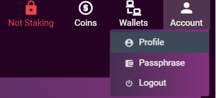
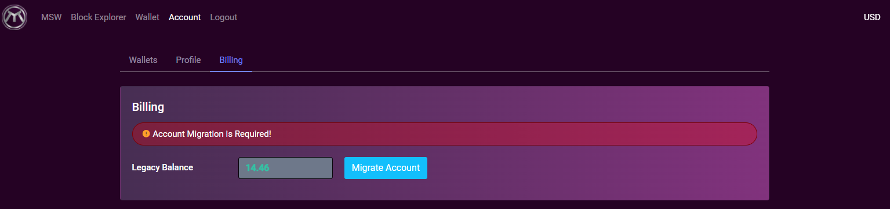
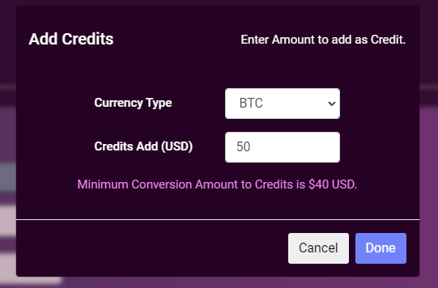

# MyStakingWallet Billing System

## Initial migration from PayPal
This only applies to users created prior to 25th Jan 2022. PayPal billing has been deprecated within MSW.

You will no longer be able to add PayPal as a payment option on your account.
This will be a mandatory migration for all MSW users and any existing recurring monthly payments via PayPal will be cancelled.
Navigating to the **Account** > **Profile** section of MSW will now show a billing tab.

You will see the remaining balance as USD credits since your last PayPal payments.

To migrate simply click the **Migrate Account** button. This process will credit your account and also cancel the existing PayPal recurring monthly payments.

You will then be presented with the billing screen. Using this you will manage ongoing payments and billing.
Rather than an automatic monthly billing cycle, MSW billing will now operate on a credit basis. The same charges for systems will apply, however you can now “top-up” your account with credits. The credits balance will be consumed at the hourly rate equivalent to the previous monthly costs.

The new system will accept payment in **BTC** & **ETH** (MRX will be coming soon), transactions will be processed by our partner, CoinsPaid, with the funds credited to your MSW account on confirmation.
It is advised to set a low balance warning; you will be emailed when your balance reduces to this amount to remind you that top-up is required.

## Adding Credit

Adding credit is simply clicking the “Add Credit” button. Choosing your preferred currency and then completing the payment, to the provided deposit address.

!!! info
    Note. The credit amount is always calculated in USD. The CoinsPaid service will provide the current market rate conversion of your selected currency.

You will then be provided with the CoinsPaid payment screen and 15 minutes with which to send your deposit.

Once the deposit received and processed the system will credit your account with the deposit amount.
You will be emailed on completion of the transaction.

## Failure to top-up
Failure to credit your account with sufficient funds will result in the service running at reduced functionality for 7 days. If funds are still not received within the 7 days, then the systems on the account will be deleted.

!!! danger
    If you **DO NOT** plan on adding more funds, you should take a backup of the wallet.dat or export your private keys prior to the 7 day functionality restriction.

## Ending your MSW service
If you do not wish to migrate to the new system or want to cancel your MSW service, simply delete the servers from within your account. 

- PayPal: PayPal users ongoing monthly deductions will be stopped at the point of deletion.
- CoinsPaid: Any remaining funds in the account deposited via the CoinsPaid service will be forfeited. It’s recommended to end your services when funds are low or have been used.
