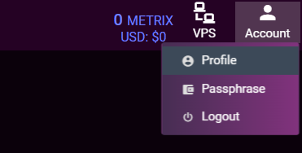
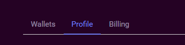

# MyStakingWallet - Recover Deleted Wallet

## How to download deleted wallets

1. Login to MyStakingWallet using you usual username and password.

2. Navigate to the Account Profile tab.  

      

3. Select the profile tab if not already selected.  

      

4. Scroll to the bottom of the profile page to find the deleted wallets button.  

      

5. Clicking this button will download your wallets to your local machine in zip format. The wallet.dat files within this zip will still be encrypted with your passphrase as used on MSW. These files can now be restored into your wallet of choice.  

!!! info
    If you require additional support please contact the Metrixcoin team in the Discord.
